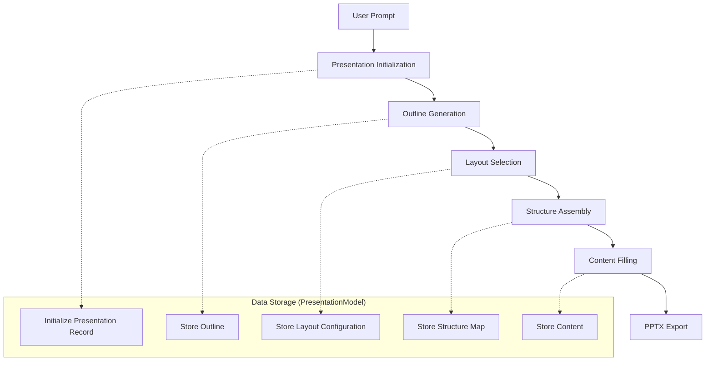
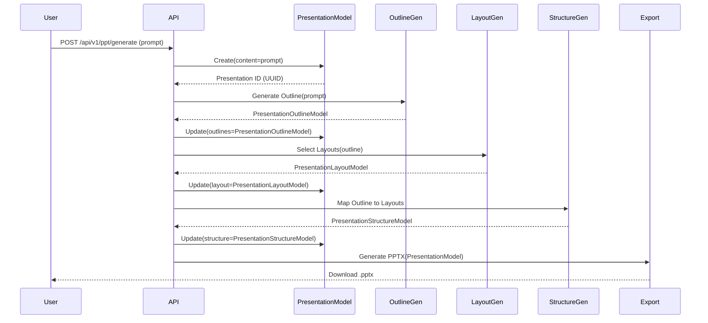

# Presentation Generation Workflow

This document outlines the workflow, architecture, and data structures involved in the Presentation Generation Pipeline.

## 1. Workflow Architecture

The generation process follows a linear pipeline:



## 2. Data Flow Diagram

This diagram illustrates how data flows between the different models and processing steps.



## 3. Node Data Structures

### 3.1 Presentation Model (Root Node)
The central data container for the entire presentation.

**File**: `servers/fastapi/models/sql/presentation.py`

```json
{
  "id": "550e8400-e29b-41d4-a716-446655440000",
  "content": "Create a presentation about AI in Healthcare",
  "n_slides": 5,
  "language": "en",
  "title": "AI in Healthcare",
  "outlines": { ... },   // See 3.2
  "layout": { ... },     // See 3.3
  "structure": { ... },  // See 3.4
  "theme": { ... },
  "created_at": "2023-10-27T10:00:00Z",
  "updated_at": "2023-10-27T10:05:00Z"
}
```

### 3.2 Presentation Outline Model
Defines the content and flow of the presentation.

**File**: `servers/fastapi/models/presentation_outline_model.py`

```json
{
  "slides": [
    {
      "content": "Introduction to AI in Healthcare"
    },
    {
      "content": "Current Applications: Diagnostics & Imaging"
    },
    {
      "content": "Future Trends: Personalized Medicine"
    },
    {
      "content": "Challenges: Privacy & Ethics"
    },
    {
      "content": "Conclusion"
    }
  ]
}
```

### 3.3 Presentation Layout Model
Defines the available slide templates and their properties.

**File**: `servers/fastapi/models/presentation_layout.py`

```json
{
  "name": "Modern Tech Theme",
  "ordered": false,
  "slides": [
    {
      "id": "title_slide",
      "name": "Title Slide",
      "description": "Main title and subtitle",
      "json_schema": {
        "title": "Title Slide",
        "type": "object",
        "properties": {
          "title": { "type": "string" },
          "subtitle": { "type": "string" }
        }
      }
    },
    {
      "id": "content_slide_image_right",
      "name": "Content with Image Right",
      "description": "Bullet points on left, image on right",
      "json_schema": {
        "title": "Content Slide",
        "type": "object",
        "properties": {
          "title": { "type": "string" },
          "bullets": { "type": "array", "items": { "type": "string" } },
          "image": { "type": "string", "format": "uri" }
        }
      }
    }
  ]
}
```

### 3.4 Presentation Structure Model
Maps the outline items to specific layout templates.

**File**: `servers/fastapi/models/presentation_structure_model.py`

```json
{
  "slides": [
    0,  // Slide 1 uses Layout at index 0 (Title Slide)
    1,  // Slide 2 uses Layout at index 1 (Content with Image Right)
    1,  // Slide 3 uses Layout at index 1
    1,  // Slide 4 uses Layout at index 1
    1   // Slide 5 uses Layout at index 1
  ]
}
```

## 4. Key Files Reference

| Component | File Path | Description |
|-----------|-----------|-------------|
| **API Router** | `servers/fastapi/api/v1/ppt/router.py` | Main entry point for PPT generation APIs. |
| **Presentation Model** | `servers/fastapi/models/sql/presentation.py` | Database model storing the presentation state. |
| **Outline Model** | `servers/fastapi/models/presentation_outline_model.py` | Pydantic model for slide outlines. |
| **Layout Model** | `servers/fastapi/models/presentation_layout.py` | Pydantic model for slide layouts. |
| **Structure Model** | `servers/fastapi/models/presentation_structure_model.py` | Pydantic model for mapping outline to layout. |
| **PPTX Elements** | `servers/fastapi/models/pptx_models.py` | Low-level PPTX element definitions (Text, Shape, Image). |
